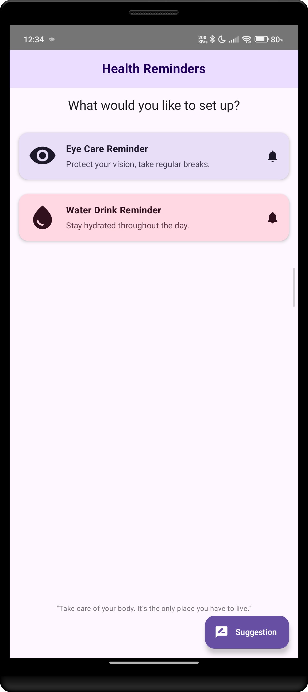
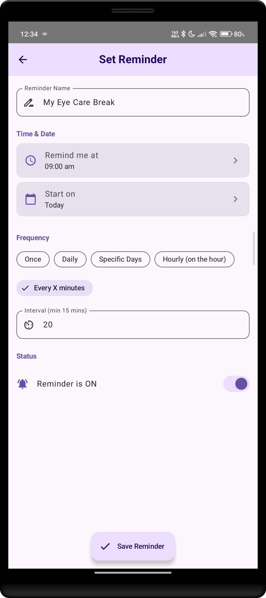
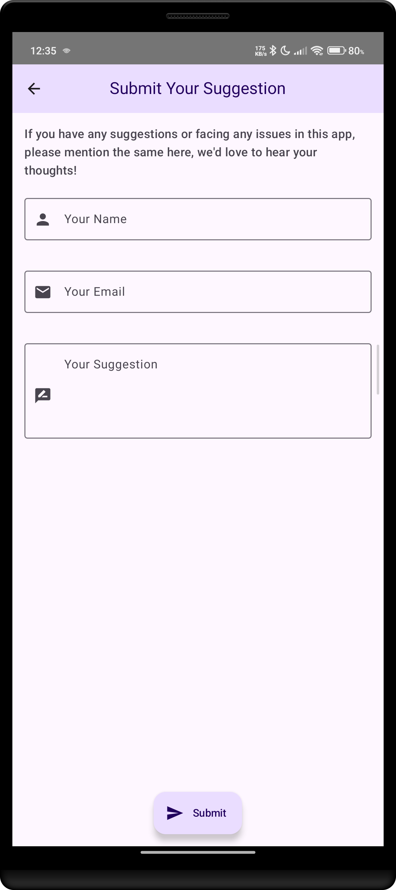

# 👁️💧 Eye & Water Reminder App

[](https://play.google.com/store/apps/details?id=com.alpha.myeyecare)  
_A simple yet powerful reminder app to take care of your **eye health** and **hydration needs**._

---

## 📱 About the App
Eye & Water Reminder is an Android application designed to remind users to:
- Take regular **eye breaks** (reducing digital strain).
- Drink enough **water** throughout the day.

The app is lightweight, simple, and **perfect for health-conscious users**.  
This repository is mainly created for **learning purposes** and is **open to contributions** from developers worldwide.

---

## 🚀 Features
✅ Smart reminders for both **eye breaks** & **water intake**  
✅ Customizable reminder frequency  
✅ User-friendly **UI with Material Design**  
✅ Lightweight & battery-efficient  
✅ Free & Open Source  
✅ Perfect for **Android learning** (Jetpack Compose, MVVM, Room, etc.)

---

## 🛠 Tech Stack
- **Language**: Kotlin
- **Architecture**: MVVM (Model-View-ViewModel)
- **UI Toolkit**: Jetpack Compose
- **Local Storage**: Room Database
- **Dependency Injection**: Hilt
- **Coroutines & Flow**: For async & reactive programming
- **Other**: Material 3, WorkManager (for background tasks)

---

## 📂 Repository Structure


```plaintext

com.alpha.books_explorer/ 
│ 
├── data/                           # Data Layer (API + DB) 
│   ├── local/                      # Room database 
│   │   ├── converters/ 
│   │   │   ├── Converters.kt 
│   │   ├── dao/ 
│   │   │   ├── FavBookDao.kt 
│   │   │   ├── ReadingList.kt 
│   │   ├── entities/ 
│   │   │   ├── BookEntity.kt 
│   │   │   ├── ReadingListEntity.kt 
│   │   └── FavBookDatabase.kt 
│   │ 
│   ├── paging/  
│   │   ├── BooksPagingSource.kt 
│   ├── remote/                     # Retrofit API 
│   │   ├── BookApiService.kt 
│   │   └── dto/ 
│   │       ├── BookSearchResponse.kt 
│   │ 
│   ├── repository/                 # Repository implementation 
│   │   └── BookRepositoryImpl.kt 
│   │ 
│   └── mappers/                    # DTO ↔ Entity ↔ Domain 
│       ├── BookMapper.kt 
│ 
├── domain/                         # Domain Layer (business logic) 
│   ├── model/ 
│   │   ├── Book.kt 
│   │ 
│   ├── repository/                 # Abstract repository interfaces 
│   │   └── BookRepository.kt 
│   │ 
│   └── usecase/                    # Use cases 
│       ├── GetBooksUseCase.kt 
│       ├── SearchBooksUseCase.kt 
│       ├── GetBookDetailsUseCase.kt 
│       ├── SaveFavoriteBookUseCase.kt 
│       └── GetFavoriteBooksUseCase.kt 
│ 
├── di/                             # Dependency Injection (Hilt) 
│   ├── LocalDbModule.kt 
│   ├── NetworkModule.kt 
│ 
├── presentation/                   # Presentation Layer 
│   ├── ui/                         # Compose UI 
│   │   ├── home/ 
│   │   │   ├── HomeScreen.kt 
│   │   │   ├── HomeViewModel.kt 
│   │   │   └── HomeUiState.kt 
│   │   ├── search/ 
│   │   │   ├── SearchScreen.kt 
│   │   │   ├── SearchViewModel.kt 
│   │   │   └── SearchUiState.kt 
│   │   ├── details/ 
│   │   │   ├── BookDetailScreen.kt 
│   │   │   ├── BookDetailViewModel.kt 
│   │   │   └── BookDetailUiState.kt 
│   │   ├── favorites/ 
│   │   │   ├── FavoritesScreen.kt 
│   │   │   ├── FavoritesViewModel.kt 
│   │   │   └── FavoritesUiState.kt 
│   │   └── profile/ 
│   │       ├── ProfileScreen.kt 
│   │       ├── ProfileViewModel.kt 
│   │       └── ProfileUiState.kt 
│   │ 
│   │ 
│   └── navigation/ 
│       └── NavGraph.kt 
│ 
├── common/                         # Common utilities & helpers 
│   ├── constants/ 
│   │   └── ApiConstants.kt 
│   ├── utils/ 
│   │   ├── NetworkResult.kt        # Sealed class for Success/Error/Loading 
│   │   ├── Extensions.kt           # Common extension functions 
│   │   └── DispatcherProvider.kt   # For coroutines testability 
│ 
├── MainActivity.kt                  # Host Compose + Navigation 
└── BooksExplorerApplication.kt               # Application class (Hilt)  

```

---

## 📸 Screenshots
| Home Screen                                           | Reminder Screen                                               | Settings                                                     |
|-------------------------------------------------------|---------------------------------------------------------------|--------------------------------------------------------------|
|  |  |  |

---

## 🤝 Contributing
We welcome contributions! 🚀  
If you’d like to add new features, improve UI/UX, or optimize performance:
1. Fork this repo 🍴
2. Create your feature branch (`git checkout -b feature/amazing-feature`)
3. Commit your changes (`git commit -m 'Add some feature'`)
4. Push to the branch (`git push origin feature/amazing-feature`)
5. Open a Pull Request 🎉

---

## 👨‍💻 Developers
- [Your Name] (Lead Developer)
- Open to all contributors! Add yourself here via PR.

---

## 🎯 Why Open Source?
This project is **for learning purposes**. Developers can explore:
- **Jetpack Compose UI development**
- **MVVM with Kotlin**
- **Dependency Injection with Hilt**
- **Room database**
- **WorkManager background scheduling**

---

## 📥 Download
Get it now on the Play Store:  
👉 [Download from Play Store](https://play.google.com/store/apps/details?id=com.alpha.myeyecare)

---

## ⭐ Support
If you find this project helpful, don’t forget to **star ⭐ the repo** and share it with others!  
